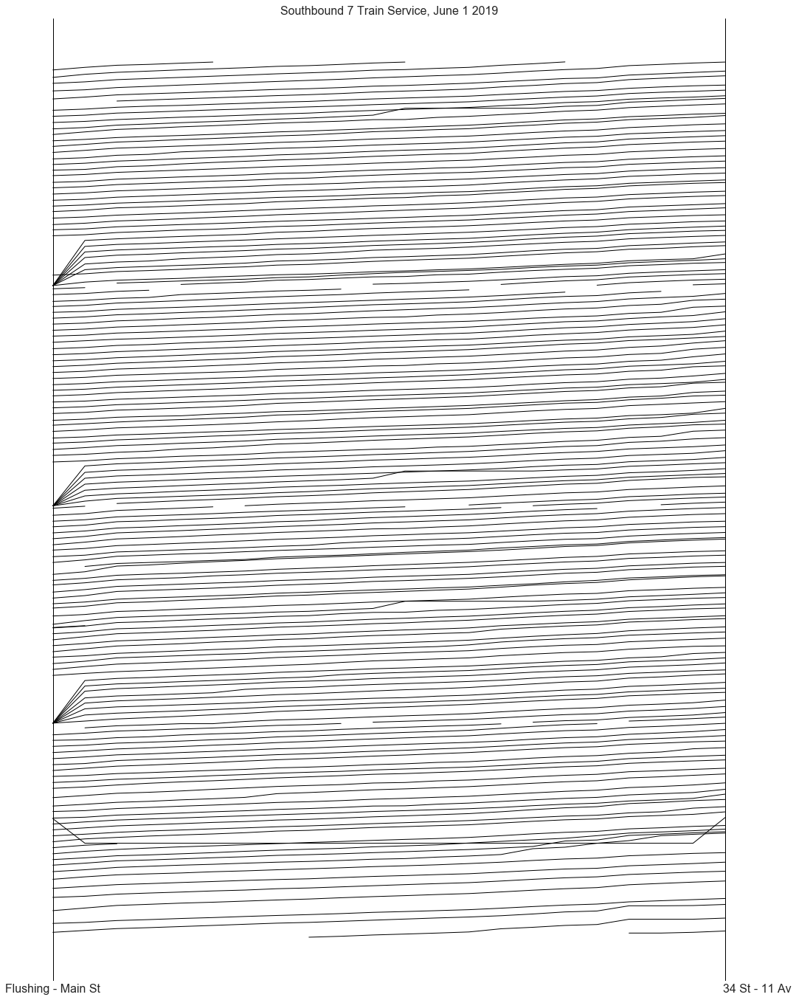

# gtfs-tripify   

Many major transit municipalities in the United States public realtime information about the state of their systems using a common format known as a [GTFS-Realtime feed](https://developers.google.com/transit/gtfs-realtime/). This is the information that the [Metropolitan Transit Authority](https://en.wikipedia.org/wiki/Metropolitan_Transportation_Authority), for example, uses to power its arrival countdown clocks on station platforms.

`gtfs-tripify` is a Python package for turning streams of GTFS-Realtime messages into a "trip log" of train arrival and departure times. The result is the ground truth history of arrivals and departures of all trains included in the inputted GTFS-RT feeds:

To learn more about `gtfs_tripify` [check out the docs](https://residentmario.github.io/gtfs-tripify/index.html).
